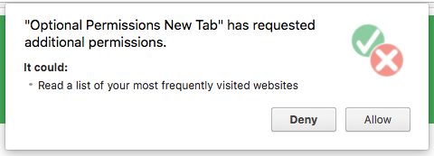
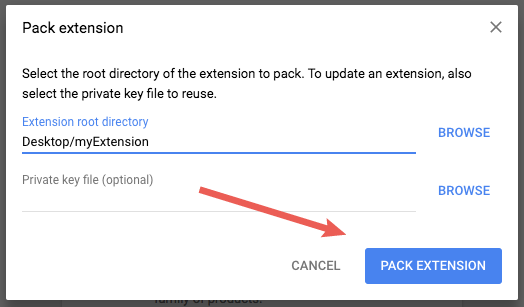

# Chrome Extension开发
[TOC]

## 1、Extension介绍

​        Chrome extensions（Chrome扩展）是Chrome浏览器上扩展程序，一般以一个按钮的形式显示在浏览器上工具栏上，在`More Tools > Extensions`可以看到所有已安装的扩展程序。


​        Chrome extension主要使用HTML、CSS和JavaScript来开发。Chrome插件市场都是打包后的extension。

extension必需有一个manifest.json文件，有一定语法规则。举个例子

```json
{
  "name": "My Extension",
  "version": "2.1",
  "description": "Gets information from Google.",
  "icons": {
    "128": "icon_16.png",
    "128": "icon_32.png",
    "128": "icon_48.png",
    "128": "icon_128.png"
  },
  "background": {
    "persistent": false,
    "scripts": ["background_script.js"]
  },
  "permissions": ["https://*.google.com/", "activeTab"],
  "browser_action": {
    "default_icon": "icon_16.png",
    "default_popup": "popup.html"
  }
}
```


* icons用于显示在浏览器工具栏上的按钮


manifest.json引用文件，使用相对路径。也可以在浏览器中直接使用下面路径访问

```
chrome-extension://<extensionID>/<pathToFile>
```

使用[chrome.runtime.getURL()](https://developer.chrome.com/extensions/extensions/runtime#method-getURL)可以获取chrome-extension://extensionID对应的文件路径。


### （1）Extension的构成

Extension包含下面几个组件

* [Manifest](https://developer.chrome.com/extensions/manifest)
* [Background Script](https://developer.chrome.com/extensions/overview#background_script)
* [UI Elements](https://developer.chrome.com/extensions/overview#pages)
* [Content Script](https://developer.chrome.com/extensions/overview#contentScripts)
* [Options Page](https://developer.chrome.com/extensions/overview#optionsPage)


#### a. Manifest

Manifest（清单）指的是Manifest.json文件，用于配置Extension。

基本语法格式，如下

```json
{
  // Required
  "manifest_version": 2,
  "name": "My Extension",
  "version": "versionString",

  // Recommended
  "default_locale": "en",
  "description": "A plain text description",
  "icons": {...},

  // Pick one (or none)
  "browser_action": {...},
  "page_action": {...},

  // Optional
  "action": ...,
  "author": ...,
  "automation": ...,
  "background": {
    // Recommended
    "persistent": false,
    // Optional
    "service_worker":
  },
  "chrome_settings_overrides": {...},
  "chrome_ui_overrides": {
    "bookmarks_ui": {
      "remove_bookmark_shortcut": true,
      "remove_button": true
    }
  },
  "chrome_url_overrides": {...},
  "commands": {...},
  "content_capabilities": ...,
  "content_scripts": [{...}],
  "content_security_policy": "policyString",
  "converted_from_user_script": ...,
  "current_locale": ...,
  "declarative_net_request": ...,
  "devtools_page": "devtools.html",
  "event_rules": [{...}],
  "externally_connectable": {
    "matches": ["*://*.example.com/*"]
  },
  "file_browser_handlers": [...],
  "file_system_provider_capabilities": {
    "configurable": true,
    "multiple_mounts": true,
    "source": "network"
  },
  "homepage_url": "http://path/to/homepage",
  "import": [{"id": "aaaaaaaaaaaaaaaaaaaaaaaaaaaaaaaa"}],
  "incognito": "spanning, split, or not_allowed",
  "input_components": ...,
  "key": "publicKey",
  "minimum_chrome_version": "versionString",
  "nacl_modules": [...],
  "oauth2": ...,
  "offline_enabled": true,
  "omnibox": {
    "keyword": "aString"
  },
  "optional_permissions": ["tabs"],
  "options_page": "options.html",
  "options_ui": {
    "chrome_style": true,
    "page": "options.html"
  },
  "permissions": ["tabs"],
  "platforms": ...,
  "replacement_web_app": ...,
  "requirements": {...},
  "sandbox": [...],
  "short_name": "Short Name",
  "signature": ...,
  "spellcheck": ...,
  "storage": {
    "managed_schema": "schema.json"
  },
  "system_indicator": ...,
  "tts_engine": {...},
  "update_url": "http://path/to/updateInfo.xml",
  "version_name": "aString",
  "web_accessible_resources": [...]
}
```


#### b. Background Script

后台脚本（Background Script），是Extension的事件处理器，可以监听浏览器的事件

常见的浏览器事件，包括

* Extension首次安装，或者更新到一个新版本
* 后台页面（background page）监听事件
* Content Script或其他Extension发送消息
* Extension的View，例如popup，调用 `runtime.getBackgroundPage`


在Manifest中注册后台脚本（Background Script），如下

```json
{
   "name": "Awesome Test Extension",
   ...
   "background": {
     "scripts": [
       "backgroundContextMenus.js",
       "backgroundOmniBox.js",
       "backgroundOauth.js"
     ],
     "persistent": false
   },
   ...
}
```


初始化Extension，可以监听`runtime.onInstalled`事件，如下

```javascript
chrome.runtime.onInstalled.addListener(function() {
  chrome.contextMenus.create({
    "id": "sampleContextMenu",
    "title": "Sample Context Menu",
    "contexts": ["selection"]
  });
});
```


注意：建立监听，必须在Background Script执行时，不能在其他函数异步回调中。举个例子

```javascript
chrome.runtime.onInstalled.addListener(function() {
  // ERROR! Events must be registered synchronously from the start of
  // the page.
  chrome.bookmarks.onCreated.addListener(function() {
    // do something
  });
});
```


如果需要移除监听，则可以在回调函数中，如下

```javascript
chrome.runtime.onMessage.addListener(function(message, sender, reply) {
    chrome.runtime.onMessage.removeListener(event);
});
```


事件过滤，有些监听可以设置过滤条件，如下

```javascript
chrome.webNavigation.onCompleted.addListener(function() {
    alert("This is my favorite website!");
}, {url: [{urlMatches : 'https://www.google.com/'}]});
```


卸载Background Script，需要将相关资源释放。例如脚本使用[message passing](https://developer.chrome.com/extensions/messaging)，需要调用[runtime.Port.disconnect](https://developer.chrome.com/extensions/runtime#property-Port-disconnect)来关闭port。例如

```javascript
chrome.runtime.onMessage.addListener(function(message, callback) {
  if (message == 'hello') {
    sendResponse({greeting: 'welcome!'})
  } else if (message == 'goodbye') {
    chrome.runtime.Port.disconnect();
  }
});
```

卸载Background Script是否卸载，可以通过More Tools > Task Manager来查看。


如果Background Script在一段时间不处于活跃状态，就会被卸载，这时会触发`chrome.runtime.onSuspend`事件，如下

```javascript
chrome.runtime.onSuspend.addListener(function() {
  console.log("Unloading.");
  chrome.browserAction.setBadgeText({text: ""});
});
```


#### c. UI Elements

UI元素（UI Elements）指定的是按钮弹出框或者创建新的tab页。主要有两种形式，[browser action](https://developer.chrome.com/extensions/browserAction)和[page action](https://developer.chrome.com/extensions/pageAction)。

* browser_action，适用于浏览器所有页面
* page_action，适用于满足条件的页面。如果不满足条件的页面，工具栏按钮则显示灰色


##### browser_action和page_action

browser_action在manifest.json中配置如下

```json
{
  "name": "My Awesome browser_action Extension",
  ...
  "browser_action": {
    ...
  }
  ...
}
```

通过[`chrome.browserAction.setBadgeText` ](https://developer.chrome.com/browserAction#method-setBadgeText)和[`chrome.browserAction.setBadgeBackgroundColor` ](https://developer.chrome.com/browserAction#method-setBadgeBackgroundColor)来设置工具栏按钮的badge样式


page_action在manifest.json中配置如下

```json
{
  "name": "My Awesome page_action Extension",
  ...
  "page_action": {
    ...
  }
  ...
}
```


page_action定义过滤规则需要通过 [`chrome.declarativeContent`](https://developer.chrome.com/declarativeContent)，举个例子，如下

```javascript
chrome.runtime.onInstalled.addListener(function() {
  // Replace all rules ...
  chrome.declarativeContent.onPageChanged.removeRules(undefined, function() {
    // With a new rule ...
    chrome.declarativeContent.onPageChanged.addRules([
      {
        // That fires when a page's URL contains a 'g' ...
        conditions: [
          new chrome.declarativeContent.PageStateMatcher({
            pageUrl: { urlContains: 'g' },
          })
        ],
        // And shows the extension's page action.
        actions: [ new chrome.declarativeContent.ShowPageAction() ]
      }
    ]);
  });
});
```


除了定义规则，还是调用 [`pageAction.show`](https://developer.chrome.com/pageAction#method-show)和[`pageAction.hide`](https://developer.chrome.com/pageAction#method-hide)来显示启用和禁用工具栏按钮，如下

```javascript
chrome.runtime.onMessage.addListener(function(req, sender) {
  chrome.storage.local.set({'address': req.address})
  chrome.pageAction.show(sender.tab.id);
  chrome.pageAction.setTitle({tabId: sender.tab.id, title: req.address});
});
```


##### Extension的图标

提供Extension的图标，在manifest.json中，通过`default_icon`字段配置，如下

```json
{
  "name": "My Awesome page_action Extension",
  ...
  "page_action": {
    "default_icon": {
      "16": "extension_toolbar_icon16.png",
      "32": "extension_toolbar_icon32.png"
    }
  }
  ...
}
```


> 1. 推荐使用16x16和32x32大小
> 2. `default_icon`字段是位于 [`browser_action`](https://developer.chrome.com/browserAction)和 [`page_action`](https://developer.chrome.com/pageAction) 字段下面


一般使用4种大小的图标，如下表

| Icon Size | Icon Use                                                     |
| :-------- | :----------------------------------------------------------- |
| 16x16     | favicon on the extension's pages                             |
| 32x32     | Windows computers often require this size. Providing this option will prevent size distortion from shrinking the 48x48 option. |
| 48x48     | displays on the extensions management page                   |
| 128x128   | displays on installation and in the Chrome Webstore          |


可以通过`icons`字段配置通用的图标，如下

```json
{
  "name": "My Awesome Extension",
  ...
  "icons": {
    "16": "extension_icon16.png",
    "32": "extension_icon32.png",
    "48": "extension_icon48.png",
    "128": "extension_icon128.png"
  }
  ...
}
```


##### 弹出框（Popup）

弹出框（Popup），类似Web页面，但不允许内联JavaScript。通过`default_popup`字段来指定HTML页面，如下

```json
{
  "name": "Drink Water Event",
  ...
  "browser_action": {
    "default_popup": "popup.html"
  }
  ...
}
```

也可以动态的指定弹出框（Popup），如下

```javascript
chrome.storage.local.get('signed_in', function(data) {
  if (data.signed_in) {
    chrome.browserAction.setPopup({popup: 'popup.html'});
  } else {
    chrome.browserAction.setPopup({popup: 'popup_sign_in.html'});
  }
});
```


##### 工具栏按钮提示（Tooltip）

工具栏按钮提示（Tooltip），通过 [`browser_action`](https://developer.chrome.com/browserAction)和[`page_action`](https://developer.chrome.com/pageAction)下面的`default_title`字段配置，用于显示提示。如下

```json
{
"name": "Tab Flipper",
 ...
  "browser_action": {
    "default_title": "Press Ctrl(Win)/Command(Mac)+Shift+Right/Left to flip tabs"
  }
...
}
```

也可以使用Chrome API动态设置，如下

```javascript
chrome.browserAction.onClicked.addListener(function(tab) {
  chrome.browserAction.setTitle({tabId: tab.id, title: "You are on tab:" + tab.id});
});
```


如果提示文案需要国际化，则建立国际化资源文件，如下

```tex
_locales/en/messages.json
_locales/es/messages.json
```

_locales/en/messages.json内容，如下

```json
{
  "__MSG_tooltip__": {
      "message": "Hello!",
      "description": "Tooltip Greeting."
  }
}
```

_locales/es/messages.json内容，如下

```json
{
  "__MSG_tooltip__": {
      "message": "Hola!",
      "description": "Tooltip Greeting."
  }
}
```

> message和description是特定的字段


```json
{
"name": "Tab Flipper",
 ...
  "browser_action": {
    "default_title": "__MSG_tooltip__"
  }
...
}
```

`default_title`字段使用国际化字符串key，例如`__MSG_tooltip__`


##### 地址栏（Omnibox）

OmniBox，通过`omnibox`字段配置触发的关键词，如下

```json
{
  "name": "Omnibox New Tab Search",\
  ...
  "omnibox": { "keyword" : "nt" },
  "default_icon": {
    "16": "newtab_search16.png",
    "32": "newtab_search32.png"
  }
  ...
}
```

当关键词在地址栏输入后，在按下Tab键，会触发Extension。例如上面关键词是nt。


通过[`omnibox.onInputEntered`](https://developer.chrome.com/omnibox#event-onInputEntered) 事件，可以获取用户在地址栏输入的文本，如下

```javascript
chrome.omnibox.onInputEntered.addListener(function(text) {
  // Encode user input for special characters , / ? : @ & = + $ #
  var newURL = 'https://www.google.com/search?q=' + encodeURIComponent(text);
  chrome.tabs.create({ url: newURL });
});
```


##### 上下文菜单（Context Menu）

上下文菜单，用于显示右键菜单。它需要`contextMenus`权限，同时需要16x16的图标，如下

```json
{
  "name": "Global Google Search",
  ...
  "permissions": ["contextMenus", "storage"],
  "icons": {
    "16": "globalGoogle16.png",
    "48": "globalGoogle48.png",
    "128": "globalGoogle128.png"
 }
 ...
}
```

上下文菜单的内容，通过[contextMenus.create](https://developer.chrome.com/contextMenus#method-create)设置，如下

```javascript
chrome.runtime.onInstalled.addListener(function() {
  for (let key of Object.keys(kLocales)) {
    chrome.contextMenus.create({
      id: key,
      title: kLocales[key],
      type: 'normal',
      contexts: ['selection'],
    });
  }
});
```


locales.js

```javascript
const kLocales = {
  'com.au': 'Australia',
  'com.br': 'Brazil',
  'ca': 'Canada',
  'cn': 'China',
  'fr': 'France',
  'it': 'Italy',
  'co.in': 'India',
  'co.jp': 'Japan',
  'com.ms': 'Mexico',
  'ru': 'Russia',
  'co.za': 'South Africa',
  'co.uk': 'United Kingdom'
};
```


##### 命令（Command）

Command，用于绑定键盘快捷键，通过`commands`字段设置

```json
{
  "name": "Tab Flipper",
  ...
  "commands": {
    "flip-tabs-forward": {
      "suggested_key": {
        "default": "Ctrl+Shift+Right",
        "mac": "Command+Shift+Right"
      },
      "description": "Flip tabs forward"
    },
    "flip-tabs-backwards": {
      "suggested_key": {
        "default": "Ctrl+Shift+Left",
        "mac": "Command+Shift+Left"
      },
      "description": "Flip tabs backwards"
    }
  }
  ...
}
```

上面定义了两个快捷键，分别命令为flip-tabs-forward和flip-tabs-backwards。


通过 [`commands.onCommand`](https://developer.chrome.com/commands#event-onCommand)事件接收快捷键，如下

```javascript
chrome.commands.onCommand.addListener(function(command) {
  chrome.tabs.query({currentWindow: true}, function(tabs) {
    // Sort tabs according to their index in the window.
    tabs.sort((a, b) => { return a.index < b.index; });
    let activeIndex = tabs.findIndex((tab) => { return tab.active; });
    let lastTab = tabs.length - 1;
    let newIndex = -1;
    if (command === 'flip-tabs-forward')
      newIndex = activeIndex === 0 ? lastTab : activeIndex - 1;
    else  // 'flip-tabs-backwards'
      newIndex = activeIndex === lastTab ? 0 : activeIndex + 1;
    chrome.tabs.update(tabs[newIndex].id, {active: true, highlighted: true});
  });
});
```


除了直接定义快捷键命名外，可以在manifest.json中设置工具栏按钮默认点击的快捷键。如下

```javascript
{
  "name": "Hello Extensions",
  "description" : "Base Level Extension",
  "version": "1.0",
  "browser_action": {
    "default_popup": "hello.html",
    "default_icon": "hello_extensions.png"
  },
  "manifest_version": 2,
  "commands": {
    "_execute_browser_action": {
      "suggested_key": {
        "default": "Ctrl+Shift+F",
        "mac": "MacCtrl+Shift+F"
      },
      "description": "Opens hello.html"
    }
  }
}
```


`_execute_browser_action`和`_execute_page_action`字段（以_开头）定义默认点击的快捷键，不用自己命名，同时省去在Background Script中配置对应的快捷键响应的处理。


##### 重载页面（Override Pages）

​        Extension可以用自定义的Web页面替换History、New Tab和Bookmarks等页面，但不支持内联JavaScript代码。通过`chrome_url_overrides`字段设置，来自定义Web页面，如下

```json
{
  "name": "Awesome Override Extension",
  ...

  "chrome_url_overrides" : {
    "newtab": "override_page.html"
  },
  ...
}
```


override_page.html，如下

```html
<html>
 <head>
  <title>New Tab</title>
 </head>
 <body>
    <h1>Hello World</h1>
  <script src="logic.js"></script>
 </body>
</html>
```


#### d. Content Script

内容脚本（Content Scripts），一般用于读写当前页面的DOM。


#### e. Options Page

选项页（Options Page），用于用户定制Extension的功能


### （2）Chrome API


​       Extension的JS脚本，除了使用Web页面上的JS API，还可以使用Chrome API。它是Chrome浏览器提供的API，能结合浏览器完成某些浏览器行为，比如在特定tab页打开url。


#### a. 异步和同步API

Chrome API提供异步和同步API。异步API一般有一个callback参数。例如

```javascript
//THIS CODE WORKS
chrome.tabs.query({'active': true}, function(tabs) {
  chrome.tabs.update(tabs[0].id, {url: newUrl});
});
someOtherFunction();
```


> update方法也是异步方法，但是并没有callback参数


同步API一般没有callback参数，结果会立即返回，例如

```javascript
// Synchronous methods have no callback option and returns a type of string
string chrome.runtime.getURL()
```


#### b. Chrome API文档

[Chrome API文档](https://developer.chrome.com/extensions/api_index)提供Chrome API的文档说明。


### （3）Extension权限管理


#### a. 必要权限（permissions）和可选权限（optional_permissions）


Manifest.json可以配置Chrome API的权限，主要分为必要权限（permissions）和可选权限（optional_permissions）。

举个例子，如下

```json
{
  "name": "Permissions Extension",
  ...
  // required permissions
  "permissions": [
    "activeTab",
    "contextMenus",
    "storage"
  ],
  // optional permissions
  "optional_permissions": [
    "topSites",
    "http://www.developer.chrome.com/*"
  ],
      ...
  "manifest_version": 2
}
```


必要权限（permissions）在安装Extension时，浏览器给出类似下面提示


而可选权限（optional_permissions）仅在Chrome API调用需要时，给出提示，例如




#### b. 检查权限

安装Unpacked Extension并不会给出权限提示，需要打包然后查看权限提示。步骤如下

* 打开开发模式（Developer mode）的勾选按钮


* 点击PACK EXTENSION，弹出框中选择Unpacked Extension的文件夹，然后点击PACK EXTENSION按钮



* 在新的弹出框中出现crx和pem文件的路径。
  * pem文件用于更新Extension需要私钥，千万不能丢掉！


* 找crx文件路径，拖拽到Chrome浏览器，可以查看浏览器给出Extension需要的权限提示


#### c. 权限更新

当Extension更新后，需要新的权限，则在工具栏按钮上变成感叹号，点击后会弹出权限申请提示。


#### d. 权限和Chrome API对照表[^3]

| Permission                                                   | Description                                                  | Warning                                                      |
| :----------------------------------------------------------- | :----------------------------------------------------------- | :----------------------------------------------------------- |
| `"http://*/*"`<br/>`"https://*/*"`<br/>`"*://*/*"`<br/>`"<all_urls>"` | Grants the extension access to all hosts. It may be possible to avoid declaring any host permissions by using the [activeTab](https://developer.chrome.com/extensions/permission_warnings#activeTab_permission) permission. | **Read and change all your data on the websites you visit**  |
| `"https://HostName.com/"`                                    | Grants the extension access to `"https://HostName.com/"`. It may be possible to avoid declaring any host permissions by using the [activeTab](https://developer.chrome.com/extensions/permission_warnings#activeTab_permission) permission. | **Read and change your data on HostName.com**                |
| `"bookmarks"`                                                | Grants your extension access to the [chrome.bookmarks](https://developer.chrome.com/extensions/bookmarks) API. | **Read and change your bookmarks**                           |
| `"clipboardRead"`                                            | Required if the extension uses `document.execCommand('paste')`. | **Read data you copy and paste**                             |
| `"clipboardWrite"`                                           | Indicates the extension uses `document.execCommand('copy')` or `document.execCommand('cut')`. | **Modify data you copy and paste**                           |
| `"contentSettings"`                                          | Grants your extension access to the [chrome.contentSettings](https://developer.chrome.com/extensions/contentSettings) API. | **Change your settings that control websites' access to features such as cookies, JavaScript, plugins, geolocation, microphone, camera etc.** |
| `"debugger"`                                                 | Grants your extension access to the [chrome.debugger](https://developer.chrome.com/extensions/debugger) API. | **Access the page debugger backend****Read and change all your data on the websites you visit** |
| `"declarativeNetRequest"`                                    | Grants your extension access to the [chrome.declarativeNetRequest](https://developer.chrome.com/extensions/declarativeNetRequest) API. | **Block page content**                                       |
| `"desktopCapture"`                                           | Grants your extension access to the [chrome.desktopCapture](https://developer.chrome.com/extensions/desktopCapture) API. | **Capture content of your screen**                           |
| `"downloads"`                                                | Grants your extension access to the [chrome.downloads](https://developer.chrome.com/extensions/downloads) API. | **Manage your downloads**                                    |
| `"geolocation"`                                              | Allows the extension to use the HTML5 [geolocation API](http://dev.w3.org/geo/api/spec-source.html) without prompting the user for permission. | **Detect your physical location**                            |
| `"history"`                                                  | Grants your extension access to the [chrome.history](https://developer.chrome.com/extensions/history) API. | **Read and change your browsing history**                    |
| `"management"`                                               | Grants the extension access to the [chrome.management](https://developer.chrome.com/extensions/management) API. | **Manage your apps, extensions, and themes**                 |
| `"nativeMessaging"`                                          | Gives the extension access to the [native messaging API](https://developer.chrome.com/extensions/messaging.html#native-messaging). | **Communicate with cooperating native applications**         |
| `"notifications"`                                            | Grants your extension access to the [chrome.notifications](https://developer.chrome.com/extensions/notifications) API. | **Display notifications**                                    |
| `"pageCapture"`                                              | Grants the extension access to the [chrome.pageCapture](https://developer.chrome.com/extensions/pageCapture) API. | **Read and change all your data on the websites you visit**  |
| `"privacy"`                                                  | Gives the extension access to the [chrome.privacy](https://developer.chrome.com/extensions/privacy) API. | **Change your privacy-related settings**                     |
| `"proxy"`                                                    | Grants the extension access to the [chrome.proxy](https://developer.chrome.com/extensions/proxy) API. | **Read and change all your data on the websites you visit**  |
| `"system.storage"`                                           | Grants the extension access to the [chrome.system.storage](https://developer.chrome.com/extensions/system.storage) API. | **Identify and eject storage devices**                       |
| `"tabCapture"`                                               | Grants the extensions access to the [chrome.tabCapture](https://developer.chrome.com/extensions/tabCapture) API. | **Read and change all your data on the websites you visit**  |
| `"tabs"`                                                     | Grants the extension access to privileged fields of the `Tab` objects used by several APIs including [chrome.tabs](https://developer.chrome.com/extensions/tabs) and [chrome.windows](https://developer.chrome.com/extensions/windows). In many circumstances the extension will not need to declare the `"tabs"` permission to make use of these APIs. | **Read your browsing history**                               |
| `"topSites"`                                                 | Grants the extension access to the [chrome.topSites](https://developer.chrome.com/extensions/topSites) API. | **Read a list of your most frequently visited websites**     |
| `"ttsEngine"`                                                | Grants the extension access to the [chrome.ttsEngine](https://developer.chrome.com/extensions/ttsEngine) API. | **Read all text spoken using synthesized speech**            |
| `"webNavigation"`                                            | Grants the extension access to the [chrome.webNavigation](https://developer.chrome.com/extensions/webNavigation) API. | **Read your browsing history**                               |


## 2、一个简单的Extension开发[^1]


### （1）开发三个文件


Extension开发，需要三个文件

* manifest.json文件，是扩展程序的清单，相当于是配置文件
* html文件，是扩展程序的内容承载。例如扩展按钮点击弹出的弹出框内容
* png图标文件，是扩展按钮的图标，用于显示在浏览器上。官方tutorial给的图标大小是16px X 16px。

以上三个文件的组织结构，是平级的，如下

```shell
$ tree .
.
├── hello.html
├── hello_extensions.png
└── manifest.json
```


以HelloWorld扩展程序为例，如下


manifest.json

```json
{
  "name": "Hello Extensions",
  "description": "Base Level Extension",
  "version": "1.0",
  "manifest_version": 2,
  "browser_action": {
    "default_popup": "hello.html",
    "default_icon": "hello_extensions.png"
  },
  "commands": {
    "_execute_browser_action": {
      "suggested_key": {
        "default": "Ctrl+Shift+F",
        "mac": "MacCtrl+Shift+F"
      },
      "description": "Opens hello.html"
    }
  }
}
```


hello.html

```html
<html>
  <body>
    <h1>Hello Extensions</h1>
  </body>
</html>
```


### （2）安装Extension

安装Extension，三个步骤，如下

* 浏览器打开`chrome://extensions`
* 勾选Developer Mode按钮
* 点击Load Unpacked Extension，选择Extension目录

完成后，浏览器工具栏会多出这个Extension按钮

MacOS系统下，Chrome安装Extension的位置为

`~/Library/Application Support/Google/Chrome/Default/Extensions`


## 3、Chrome官方Tutorial[^2]


## 4、自定义Extension


### （1）QRCodeHelper

用于显示当前页面的url地址的二维码，并允许自定义url地址。


## References

[^1]:https://developer.chrome.com/extensions
[^2]:https://developer.chrome.com/extensions/getstarted

[^3]:https://developer.chrome.com/extensions/permission_warnings#permissions_with_warnings


